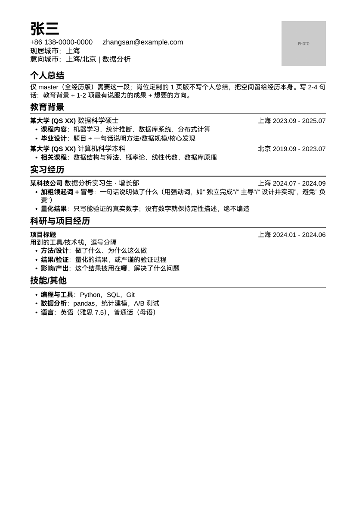
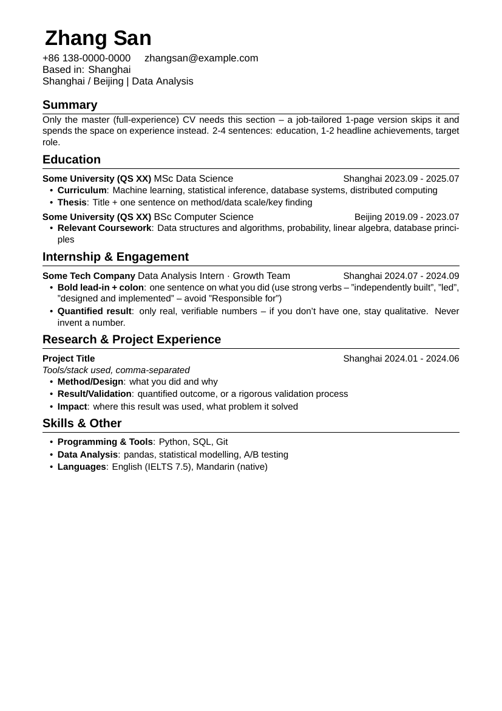

# bilingual-cv-kit

A LaTeX template + [Claude Code](https://claude.com/product/claude-code) skill for maintaining a **bilingual (Chinese/English) CV system**: one master "full experience" CV with no page limit, plus as many job-direction-tailored 1-page versions as you need — all built from a shared class file and a reusable personal "content bank," with an explicit workflow for tailoring a new version to a job description.

| Chinese example | English example |
|---|---|
|  |  |

## Why this exists

Job hunting in a bilingual (or multi-direction) market usually means maintaining N slightly-different CVs by hand — copy-pasting between Word docs, losing track of which version has which bullet, and re-fighting the same LaTeX spacing bugs every time. This template solves the mechanical part:

- One shared LaTeX class (`my-resume.cls`) with wrap-safe entry layout, tight but readable spacing, and a documented history of the font-scoping/spacing bugs it took to get there (see `CONTENT_NOTES.md`) — so you don't have to rediscover them.
- A **content bank** convention: write every real experience once, tag it, then assemble job-tailored versions by filtering tags — not by copy-pasting and drifting.
- A **tailoring workflow** (in `CONTENT_NOTES.md`) covering JD-keyword parsing, STAR-structured bullet writing, page-fill heuristics, and file-naming conventions, meant to be followed by a human or handed to an LLM as instructions.
- Self-contained CJK support (HarmonyOS Sans SC, freely redistributable, bundled in `template/fonts/`) — no system font installation required to compile.

## What's in this repo

```
bilingual-cv-kit/
├── SKILL.md              Claude Code skill definition
├── CONTENT_NOTES.md       command cheat-sheet, writing rules, content-bank format, tailoring workflow
├── template/
│   ├── my-resume.cls              LaTeX class: header, \entry, \role, section styling
│   ├── my-resume-zh.sty            Chinese (CJK) font configuration
│   ├── linespacing_fix.sty         small spacing patch
│   ├── fonts/                      bundled HarmonyOS Sans SC (Regular + Bold) + license
│   ├── example_zh.tex / example_en.tex   worked example using a fictional persona
│   └── example_zh.pdf / example_en.pdf   compiled output of the above
└── assets/                README preview images
```

The example `.tex` files are a **format reference, not real content** — they use a fictional persona ("张三"/"Zhang San") and placeholder bullets to demonstrate every macro. Replace them with your own information before using this for a real application.

## Quickstart

Requires a TeX distribution with `xelatex` (e.g. TeX Live) and, for the merged-PDF step, `pdfunite` (part of `poppler-utils`).

```bash
cd template
xelatex example_zh.tex
xelatex example_en.tex
# optional: merge into one Chinese-then-English PDF
pdfunite example_zh.pdf example_en.pdf example_merged.pdf
```

To start your own CV: copy `template/` to a new location, rename `example_zh.tex`/`example_en.tex` to your master CV, replace the placeholder name/contact/photo/content with your own, and start filling in `CONTENT_NOTES.md`'s content-bank section with your real, verified experiences. Then follow the "Tailoring workflow" in `CONTENT_NOTES.md` to build a job-direction-specific 1-page version.

## Using it as a Claude Code skill

```bash
git clone <this-repo-url> ~/.claude/skills/bilingual-cv-kit
```

Once installed, ask Claude Code (in any project) to build or tailor a CV in this style — it will read `SKILL.md`, then `CONTENT_NOTES.md`, and walk through setting up your own copy of the template and content bank on first use. Claude will not invent experiences or numbers on your behalf — see the anti-fabrication rule in `CONTENT_NOTES.md`; it's there because generic-sounding filler is worse than a shorter, honest CV.

## License

The LaTeX class/style files and documentation in this repo are released under the MIT License (see `LICENSE`). The bundled HarmonyOS Sans SC font files are redistributed under Huawei's own HarmonyOS Sans Fonts License Agreement (see `template/fonts/HARMONYOS_SANS_LICENSE.txt`), which permits free use, embedding, and redistribution.
